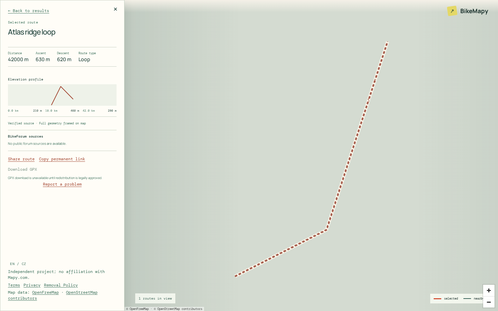
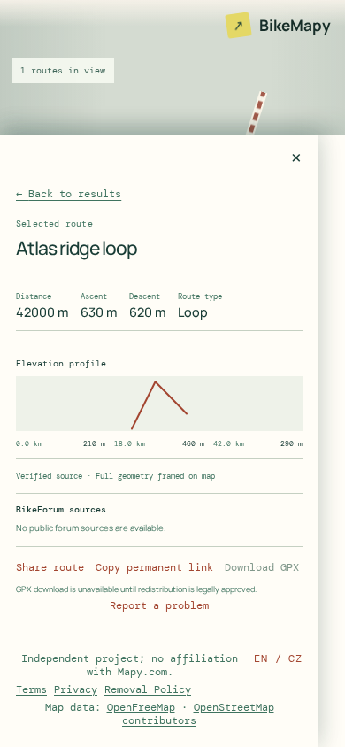

# BikeMapy

BikeMapy is a map-first catalogue of cycling routes shared in BikeForum
discussions. It combines a searchable route archive with source attribution,
route geometry, and the context needed to revisit the original post.

This is a public portfolio repository containing a working application and its
engineering documentation. The source is public; the production service is
not being claimed as publicly launched. Product, privacy, and legal gates for
an eventual launch remain documented and explicit.

## What is implemented

- A responsive React and TypeScript interface with a MapLibre map, route list,
  synchronized selection, URL-addressable filters and viewport state, Czech
  and English translations, route details, sharing, and source links.
- A versioned Django REST API with paginated route search, bounded viewport
  queries, selected-route geometry, OpenAPI documentation, health endpoints,
  and a generated TypeScript client contract.
- A modular Django backend for route metadata, immutable route versions,
  BikeForum source provenance, validation, conservative similarity detection,
  variants, source availability, and moderation audit history.
- A resumable, rate-limited BikeForum ingestion pipeline with checkpointed
  Celery work, safe HTML/GPX boundaries, and a replaceable Mapy GPX adapter.
  Extraction and publication remain controlled by independent deployment
  gates.
- Owner-only administration using GitHub OAuth and an immutable GitHub ID
  allowlist, including route review, metadata, duplicate decisions, source
  removal, anonymous report review, and aggregate product counters.
- Anonymous route reports protected by Turnstile, a honeypot, rate limits,
  bounded retention, and append-only audit events. Public GPX redistribution
  is disabled until its legal gate is approved.
- Docker Compose development and production-like topologies with PostGIS,
  Redis, Celery, Nginx, health checks, immutable backend image builds,
  backups, restore drills, and rollback rehearsal scripts.

## Screenshots

The checked-in screenshots show the implemented map-first interaction on
desktop and mobile:





Additional accessibility and responsive evidence is available in
[`docs/screenshots/`](docs/screenshots/) and the related end-to-end tests.

## Architecture and technology

BikeMapy is a modular monolith with a separate frontend:

- **Frontend:** React 19, TypeScript, Vite, MapLibre GL JS, TanStack Query,
  `openapi-fetch`, and pnpm.
- **Backend:** Python 3.13, Django 5.2, Django REST Framework, GeoDjango,
  Celery, and `django-allauth`.
- **Data and jobs:** PostgreSQL/PostGIS is the source of truth; Redis backs
  Celery and bounded rate limiting; GPX payloads use Django storage behind a
  private volume.
- **Ingestion:** `httpx`, Beautiful Soup, `lxml`, strict URL and DNS checks,
  bounded requests, and `mapy-gpx-exporter[frpc]` behind an adapter.
- **Delivery:** Docker Compose, Nginx, Cloudflare Pages/Tunnel integration,
  and commit-addressable images in GitHub Container Registry.

The public API is deliberately bounded: it serves published routes and
selected geometry, not a bulk GPX or database export. PostGIS simplified
geometries and heatmap products support map browsing without exposing internal
storage.

## Run locally

Requirements are Docker Engine or Docker Desktop with Compose v2, Python 3.13
with [uv](https://docs.astral.sh/uv/), and Node.js 22 with Corepack for
optional host-side frontend checks.

```sh
cp .env.example .env
docker compose up --build
```

Open the frontend at <http://localhost:5173>, the backend at
<http://localhost:8000>, and the API explorer at
<http://localhost:8000/api/docs/>. Apply migrations in another terminal:

```sh
docker compose exec backend uv run --locked --no-dev \
  python backend/manage.py migrate
```

The complete local development workflow, crawler safety boundaries, worker
smoke test, integration setup, and configuration reference are in the
[local development guide](docs/local-development.md).

## Quality and security

Install the locked development dependencies with `make install`. The normal
checks are:

```sh
make lint       # Ruff, ESLint, and Prettier
make typecheck  # mypy and TypeScript
make test       # pytest and Vitest with coverage
make check      # lint, type-check, test, and frontend build
```

CI additionally runs PostGIS/Redis integration tests, disposable production
Compose smoke tests, browser accessibility and interaction tests, CodeQL,
Gitleaks, dependency audits, backup restore drills, and launch rehearsals.
Read [CONTRIBUTING.md](CONTRIBUTING.md) before opening an issue-scoped change;
the [security policy](SECURITY.md) explains private vulnerability reporting
and the main trust boundaries.

## Documentation

- [Product specification](docs/product-spec.md) — requirements, architecture,
  quality direction, and future boundaries.
- [Local development guide](docs/local-development.md) — Compose setup,
  crawler controls, commands, and secrets.
- [Deployment runbook](docs/deployment.md) — image promotion, Cloudflare
  integration, backups, rollback, and production safeguards.
- [Owner administration](docs/administration.md) — moderation, reports, and
  analytics workflows.
- [Privacy notice](docs/privacy.md), [Terms of Use](docs/terms.md), and
  [Removal Policy](docs/removal-policy.md) — launch-draft public notices.
- [Legal review](docs/legal-review.md) and
  [launch verification](docs/launch-verification.md) — unresolved gates and
  evidence requirements.
- [Private Strava game specification](docs/game-spec.md) — a separate,
  disabled-by-default future module that does not expand the public catalogue.

## Project status and launch boundary

Core catalogue, map browsing, API, ingestion, moderation, reporting, and
quality automation are implemented and continuously verified on `main`. Some
capabilities remain deliberately gated or future-facing: category filtering
in the frontend, GPX extraction in ordinary local/preview environments, the
private Strava module, and production deployment.

Publishing this repository does not publish a live service or grant rights to
third-party content. Before a production launch, the owner must complete the
legal, privacy, attribution, operator-contact, retention, provider, and
operational gates in [the legal review](docs/legal-review.md). In particular,
do not enable crawling against production sources or public GPX downloads
until the documented approvals and deployment flags are in place.
